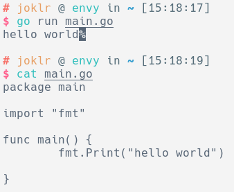

# linux优化终端"oh-my-zsh"

[zsh](https://www.zsh.org/)是一个功能强大的shell，甚至是arch linux安装系统的默认shell。但是由于其配置各种麻烦导致很少有人使用。直到[oh-my-zsh](https://ohmyz.sh/)出现，对zsh做了一层封装，简化配置文件使得zsh逐渐有人问津。

本人现在日常使用的arch linux得益于强大的包管理器使得安装程序都非常简单，但最近想在云服务器上配置zsh，服务器使用的是ubuntu server。包管理器apt不是很给力，需要动手的就比较多了。


### 相关命令

查看系统装有的终端：

```shell
cat /etc/shells
```

设置系统默认终端：

```shell
chsh -s /bin/zsh	# 设置默认终端为zsh
```


### zsh安装

apt包中有zsh可以直接安装：

```shell
$ apt-get insall zsh
```


--------------------

oh-my-zsh安装：

使用curl

```shell
$ sh -c "$(curl -fsSL https://raw.github.com/ohmyzsh/ohmyzsh/master/tools/install.sh)"
```

使用wget

```shell
$ sh -c "$(wget https://raw.github.com/ohmyzsh/ohmyzsh/master/tools/install.sh -O -)"
```


### zsh配置

安装zsh和oh-my-zsh后首次启动zsh会生成默认配置文件`$USER/.zshrc`

这里推荐几项简单配置：

```
DISABLE_AUTO_UPDATE="true"			# 禁用自动更新（网络问题要更新也不这样更新）
alias zshconfig="vim ~/.zshrc"		# 输入zshconfig直接进入编辑配置文件

# 设置对应后缀名文件的默认启动程序
alias -s sh=bash					# shell脚本
alias -s gz="tar -zxvf"				# .tar.gz压缩包
alias -s zip=unzip					# .zip压缩包
alias -s md=typora					# .md
```


zsh对程序输出有特殊处理，如果程序最后输出不是换行符就会在输出末尾添加反色的`%`，就像这样：



通常我们不需要这样的显式提醒，所以通过配置项修改这问题：

```
PROMPT_EOL_MARK=''
```

-----------------------------

顺带推荐一个个人觉得不错的zsh主题`ys`

配置项修改:

```
ZSH_THEME="ys"
```
-----------------------

全部配置修改完毕后重新加载配置或重启终端（程序结尾输出%配置需重启终端）

```shell
source ~/.zshrc					# 重新加载配置
```


### zsh插件推荐

zsh的强大功能得益于插件系统，而插件的使用方法也非常简单：

安装插件后在`.zshrc`文件中找到`plugins`行，添加插件名：

```
plugins=([plugins already use] newPluginName)			# 插件名之间以空格分隔
```

用户自定义插件安装只要将插件放在`/usr/share/oh-my-zsh/custom/plugins/插件名`目录下即可

这里简单介绍几个常用插件：

* [git](https://github.com/ohmyzsh/ohmyzsh/tree/master/plugins/git)

  zsh默认内置插件，进入git仓库目录时可以自动获取目录信息，就像这样：

  

  同时有一个缺点是如果git仓库过大、记录过多进入目录是会有卡顿

* [zsh-syntax-highlighting](https://github.com/zsh-users/zsh-syntax-highlighting)

  语法高亮插件

* [zsh-autosuggestions](https://github.com/zsh-users/zsh-autosuggestions)

  根据历史命令自动补全：

  

* sudo

  输入命令后按两次esc自动在命令前补全`sudo`

* [autojump](https://github.com/ohmyzsh/ohmyzsh/tree/master/plugins/autojump)

  输入`j 模糊目录名`可以跳转到去过的目录

