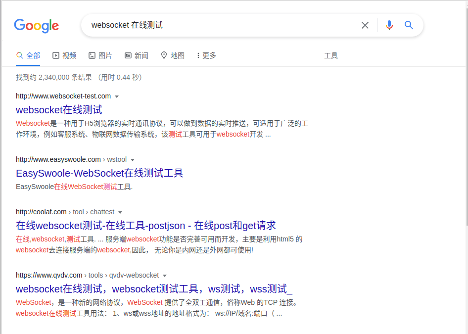

# go实现websocket服务踩坑

### 起因

最近在用写一个websocket订阅的服务，需求是用户可以通过websocket连接实时获取数据更新（防止用户内网的webhook访问不到而提出的解决方案）。由于golang`x/net`包下的websocket库[维护不善](https://github.com/golang/go/issues/18152)，只能将目光放在第三方库上，自然就选了github上星星最多的`gorilla/websocket`。

### 踩坑记录

* 对websocket协议支持问题

对于我这种最基础的需求，我天真地认为随便一个websocket库就已经后我用了，开始照官方给的示例写的客户端和服务端看起来很好，api调用也很简单。之后我的改动也一直在用示例客户端测试，都一切正常。直到我写完脑子一热网上随便搜了一个websocket在线测试（就像下面这样）试了一下。。



然后我发现这样的在线测试没有一个能连上我的服务，统一报错是`gorilla/websocket`库不支持带`Sec-Websocket-Extensions`Header的连接。之后我用postman和python里随便一个websocket库测试结果也是一样。**问题来了**。

我去找了[rfc6455](https://datatracker.ietf.org/doc/html/rfc6455#section-11.3.2)中 对`Sec-Websocket-Extensions`头部信息的描述，在我的工地英语看来这个头部作用应该是客户端与服务端协商协议扩展的，由客户端发出希望使用的扩展，之后服务器回应支持的扩展，就像HTTP中那些协商报头的流程一样。

之后我又去看了`gorilla/websocket`的源码，下面是[具体实现](https://github.com/gorilla/websocket/blob/master/server.go#L142)：

```go
func (u *Upgrader) Upgrade(w http.ResponseWriter, r *http.Request, responseHeader http.Header) (*Conn, error) {
	const badHandshake = "websocket: the client is not using the websocket protocol: "

	// ...

	if _, ok := responseHeader["Sec-Websocket-Extensions"]; ok {
		return u.returnError(w, r, http.StatusInternalServerError, "websocket: application specific 'Sec-WebSocket-Extensions' headers are unsupported")
	}
    
    // ...
}
```

？？？遇到带`Sec-Websocket-Extensions`Header的连接直接丢弃了？

我在github上找到[相关issues](https://github.com/gorilla/websocket/issues/540)居然已经关闭了，而且看起来说解决了。但是就现在结果而言postman以及其他websocket库都连不上来我觉得这个issues就不应该关闭，应该不会是我找到的测试工具恰好都不是rfc6455的标准实现同时恰好我没看懂rfc6455的原文吧。（甚至在postman中可以自定义websocket请求头的情况下`Sec-Websocket-Extensions`都是默认必须携带的）

经过这一顿折腾我换用了[gobwas/ws](https://github.com/gobwas/ws)，可以保证的一点就是示例代码都能直接用postman测试连接成功，还有号称零拷贝升级协议，通过`wsutil`支持底层api等功能，听起来很厉害，不过我还没有实际使用，毕竟简单api已经足够我的需求了。

总结一下`gorilla/websocket`我总觉得怪怪的，包括开发者对待issues的态度，已经对rfc6455的实现（主要星星还这么多）。如过同时用go做定制的服务端和客户端的话整体应该是没有问题的，但是如果希望实现rfc6455的客户端都可以正常连接，或者说希望大部分用户可以正常连接的话可能就需要换个库了。


* 关于websocket upgrade请求的http请求类型

随便一搜就可以找到大家都是以GET请求来接upgrade的，但是没有一个人说明是为什么。

`gorilla/websocket`中[写的也很明确]((https://github.com/gorilla/websocket/blob/master/server.go#L134))：

```go
func (u *Upgrader) Upgrade(w http.ResponseWriter, r *http.Request, responseHeader http.Header) (*Conn, error) {
	const badHandshake = "websocket: the client is not using the websocket protocol: "

	// ...

	if r.Method != "GET" {
		return u.returnError(w, r, http.StatusMethodNotAllowed, badHandshake+"request method is not GET")
	}
    
    // ...
}
```

直到我换用`gowas/ws`看[源码](https://github.com/gobwas/ws/blob/master/server.go#L169)时看到：

```go
	// See https://tools.ietf.org/html/rfc6455#section-4.1
	// The method of the request MUST be GET, and the HTTP version MUST be at least 1.1.
```

两行注释直接告诉了我想要看的，同时给出rfc6455相关内容，这里顺便指出。
